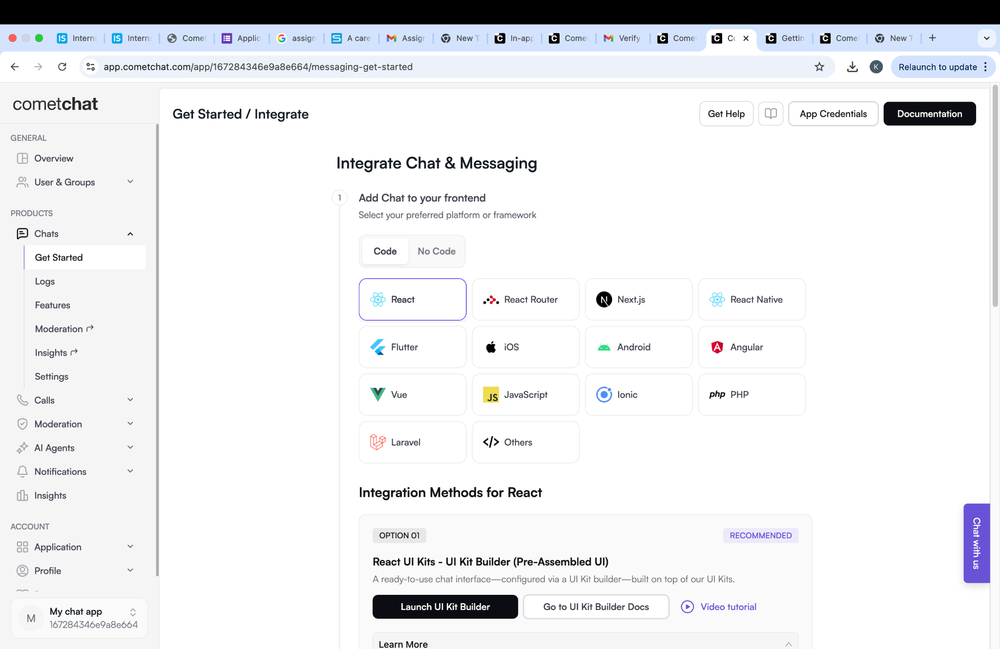
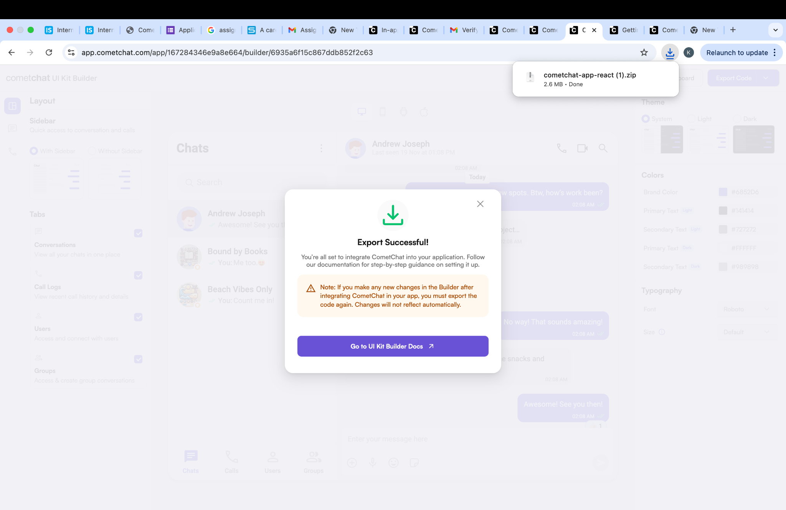
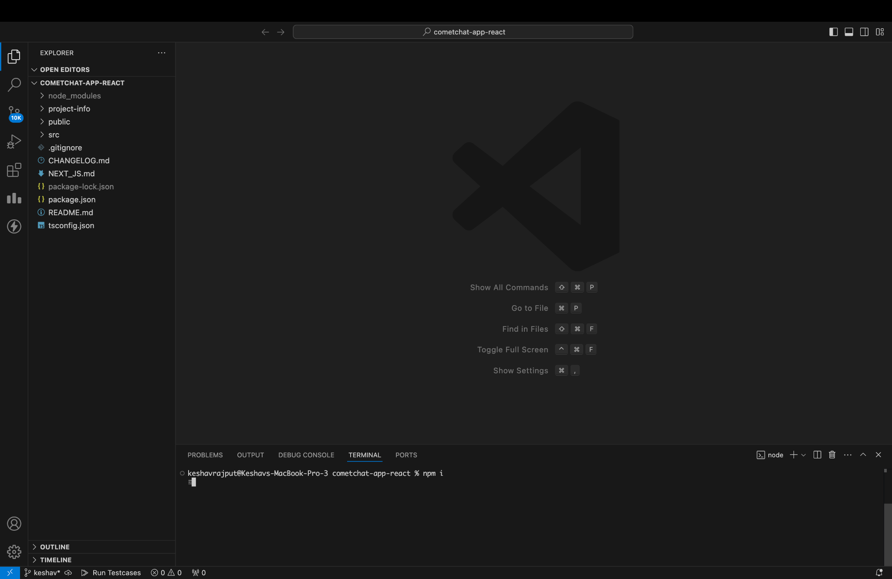
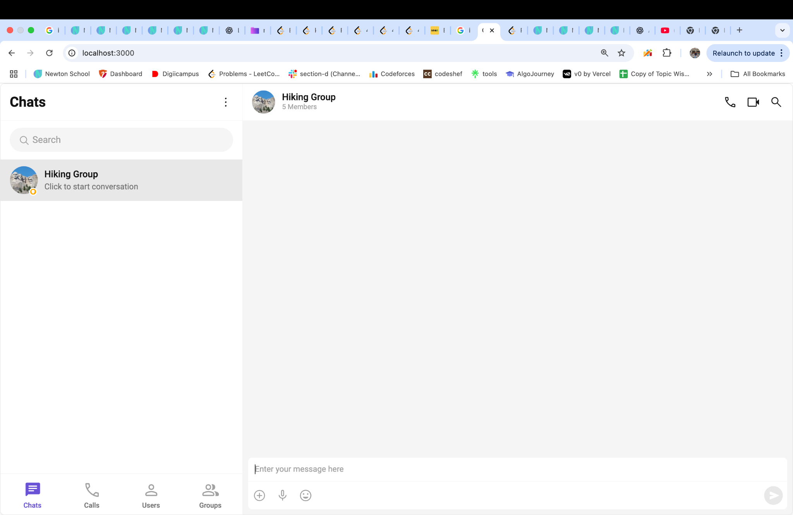

CometChat Internship Task – React UI Kit Implementation

  

🚀 Overview

This repository contains my implementation of the CometChat UI Kit using React, completed as part of the CometChat Internship Task.

I explored:

Dashboard

UI Kit Builder

Configuration & docs

Running the UI Kit locally

Along the way, I documented all Expected vs Actual behavior, friction points, unclear steps, and improvements.

⚙️ Tech Stack

React

CometChat UI Kit

Node.js

npm

🛠 How to Run My Project
git clone <this-repo>
cd project
npm install
npm run dev   # OR npm start

🔑 Add Your App Credentials

In constants.js or .env:

export const COMETCHAT_CONSTANTS = {
  APP_ID: "", 
  REGION: "", 
  AUTH_KEY: "", 
};

You get these from your CometChat Dashboard.

📌 Internship Findings (Main Required Section)
1️⃣ Dashboard

Expected: Clear starting point & quick setup
Actual: UI Kit Builder is slightly hidden behind multiple menu items
Issue: First-time users may feel unsure where to begin
Suggestion: Add “Start Here” onboarding card for new users

2️⃣ UI Kit Builder

Expected: Each toggle clearly explains what it does
Actual: Some features lack short explanations
Friction: Users may turn things ON/OFF without understanding outcome
Suggestion: Add tooltip or short description under each option

3️⃣ Documentation

Expected: One simple guide inside the downloaded project
Actual: Docs are split across pages, requires switching
Missing: Quick Start in project folder
Suggestion: Provide README-FIRST.md inside exported UI Kit

4️⃣ Implementation (UI running locally)

Expected: Auto load first conversation
Actual: I had to select user manually
Suggestion: Auto-login or open sample chat for first load

Expected: See messages instantly
Actual: UI shows groups first
Suggestion: Show “Welcome, click to start chatting” message

📝 Screenshots
Dashboard

UI Kit Builder

Terminal & Setup

Chat Running 💬

🎯 Summary of Recommendations

Onboarding guide for first-time users

Tooltip help on each toggle

Local Quick Start instructions

Auto-select first conversation

Welcome chat message

✨ Prepared By

Name: Keshav Rajput
Email: keshavrajput09373@gmail.com

📬 Internship Task Requirements covered

✔ Dashboard explored
✔ UI Kit Builder used
✔ React implementation working
✔ Screenshots included
✔ Findings & suggestions documented
✔ Ready for submission

🤝 Special Note

Thank you for reviewing my submission. I truly enjoyed exploring the platform and understanding the developer workflow. I look forward to contributing further if selected.

🟩 END OF README
